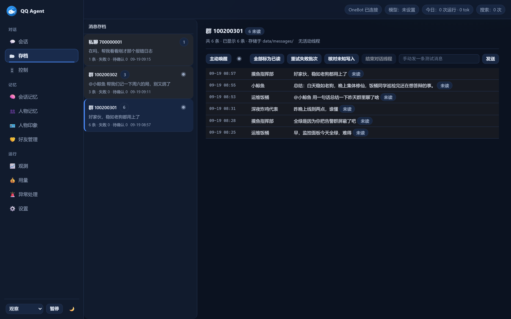

<div align="center">


# QQ Agent Plus

**A QQ group-chat agent for Linux servers — sends separate bubbles, uses stickers, remembers people, ships with an ops CLI**

[](https://github.com/sakurawwwxh/qq-agent-plus/actions/workflows/ci.yml)
[](LICENSE)
[](https://github.com/sakurawwwxh/qq-agent-plus/stargazers)
[](https://github.com/sakurawwwxh/qq-agent-plus/commits/main)
[](package.json)
[](docs/LINUX.md)
[](https://github.com/botuniverse/onebot-11)

[简体中文](README.md) ｜ **English**



</div>

A QQ group-chat agent for Linux servers. It talks to an external OneBot v11 service and runs
each turn as an isolated OpenAI Chat Completions session — no DSH, MCP, Electron or Windows runtime.

## ✨ Highlights

Every item below comes from a real failure we hit in production; [CHANGES](docs/CHANGES.md)
records the failure mode and the effect of each fix.

- **Conversation behaviour** — split replies across bubbles, read images by attitude instead of
  describing them, keep the sticker catalogue in the system prompt, self-check before finishing.
- **Send path robustness** — retry transient send failures, QQ system faces, message-id
  normalisation, inline tool-call fallback parsing.
- **Sticker system** — auto-collect with QQ favourites first, fuzzy lookup fallback, sync guard so
  an API hiccup cannot wipe the local library.
- **Proactive talk** — multiple active windows, interval guard, skip-reason logging, follow-up
  nudge when nobody answers, catch-up for messages missed during restarts.
- **Model access** — per-purpose thinking switch, retry on provider moderation refusals, automatic
  fallback model.

## 🖼 Demo

Every ops command ships with the app (`src/ops.js`); read-only commands never touch your data:

```text
$ node src/ops.js audit
  [ok] qq-agent-linux.service  active
  [ok] qq-agent-backup.timer   enabled (next: Sun 04:10)
  [ok] process-guard.timer     enabled (every 10 min)
  js syntax: 62/62 passed    undefined calls: 0
  console API: 200           account: online
===== result =====
  all green (0 anomalies)

$ node src/ops.js watch-send --minutes=5
baseline: outbox max rowid=17, pending=0
SEND_OK first new row: rowid=18 (send_message)
```

One turn in a group chat (illustration — real chat logs are never published): after picking up
the other person's message the bot continues with its own half in separate bubbles, and uses a
sticker when it fits:

```text
member:  playing tonight?
bot:     yes
bot:     just finished dinner, give me ten minutes
bot:     [sticker: stop dawdling]
```


## 🚀 Quick start

Full Linux stack (SnowLuma + OneBot + QQ Agent) on a fresh machine:

```bash
git clone https://github.com/sakurawwwxh/qq-agent-plus.git
cd qq-agent-plus
bash deploy-all.sh
```

The installer asks for the deployment directory and ports, installs Docker (needs sudo),
downloads SnowLuma, configures OneBot and writes all service credentials.
See the [Chinese README](README.md#-全栈一键部署) or [docs/LINUX.md](docs/LINUX.md) for details.

## 🛠 Ops CLI

All operational tooling lives in the code — a single entry point, Node built-ins only:

```bash
node src/ops.js help          # 子命令列表
node src/ops.js audit         # 服务 + 代码 + 数据体检（只读）
node src/ops.js audit-host    # 主机体检（只读）
node src/ops.js scan --strict # 未定义调用扫描（CI 用严格模式）
node src/ops.js backup --confirm
node src/ops.js guard --confirm
node src/ops.js watch-send --minutes=5
node src/ops.js install-timers --print
```

Destructive commands require `--confirm` and support `--dry-run` / `--print` previews.
Paths and credentials come from environment variables (`QQ_AGENT_*`, `SSH*`); no real
addresses or secrets are stored in the repository. See [docs/OPS.md](docs/OPS.md).

## ✅ Verification

```bash
npm run test:unit     # unit tests
npm run test:local    # local regression (uses a temp data dir, never production data)
node src/ops.js scan --strict
```

CI runs the same steps on every push and pull request. No known issue is currently
open on this baseline; see [KNOWN-ISSUES](docs/KNOWN-ISSUES.md) for the history.

When the console says OneBot is not connected, the reason is in `onebot.error` —
see [Troubleshooting](docs/LINUX.md#onebot-shows-not-connected).

## 📄 License

MIT (see [LICENSE](LICENSE)). Derivation and third-party copyright are documented in
[NOTICE](NOTICE.md). The OneBot implementation is separate software under its own license.
